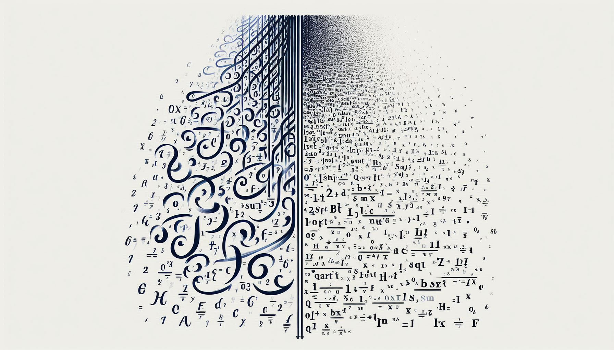

# Math2LaTeX
Welcome to LaTeX-OCR, an open-source implementation of a photomath style scan-and-render LaTeX OCR model! We use the power of PyTorch to scan your handwritten math, whether it be on tablet or paper, and convert it to LaTeX code. No more typing out complex equations - just write it down, scan it, and let LaTeX-OCR do the rest.


## Samples


_From top to bottom: Ground truth, predicted LaTeX._

On test samples from the CRHOME 2013 handwritten digit competition:


From a tablet handwritten validation image:


## Features

- **Handwriting Recognition**: Uses a deep learning model trained on a large dataset of handwritten mathematical symbols and equations.
- **LaTeX Conversion**: Converts recognized handwriting into LaTeX code, ready to be used in your documents.
- **Open-Source**: All the details of our implementation can be found in this repository.

## Installation

To get started with Math2LaTeX, you'll need to have Python 3.6+ and PyTorch 1.0+ installed. To finetune your own model, follow the instructions below to set up the dataset.

2. Go to [Kaggle's Handwritten Mathematical Expressions](https://www.kaggle.com/datasets/rtatman/handwritten-mathematical-expressions) and download the dataset. Move `archive.zip` into the `Math2LaTeX` directory.
3. Run the following:
```python
conda create -n latexocr python==3.11
conda activate latexocr
pip install -r requirements.txt
bash ./setup.sh
```
You should see `all checks passed` after running `setup.sh`.
4. Images can be found in `img_data`, and image name / label pairs are in `img_data/labels.csv`.

## Todo:
- [x] BLIP baseline.
- [x] TrOCR experiments.
- [x] Handwritten text data for evaluation.
- [x] Pretrain on additional rendered latex data found at https://zenodo.org/api/records/56198/files-archive.

# Not yet implemented:
- [ ] RCNN + TrOCR segmentation-OCR pipeline.
- [ ] Model distillation and quantization.
- [ ] Rearrange code structure to a python package.

## Usage

To begin, run `train_TrOCR.ipynb` in `scripts`. Scroll down to the "Validation on REAL Handwritten Digits" header to run the model on your own validation images.

## Training the Model

Call `python scripts/train_TrOCR.py` with the `--gpu` flag to indicate which GPU to use. Default is 0.

## Contributing

Contributions to LaTeX-OCR are welcome! Whether it's bug reports, feature requests, or new code, we appreciate all help.

## License

LaTeX-OCR is licensed under the MIT License. See [LICENSE](LICENSE) for more details.

## Acknowledgements
This project was originally developed as a course project at UCLA in collaboration with [Leon Lenk](https://github.com/leonlenk), [Artin Kim](https://github.com/artinkim), and [Maxine Wu](https://github.com/maxinewu5). The original repository can be found at [LaTeX-OCR](https://github.com/leonlenk/LaTeX_OCR). Special thanks to Leon for the initial collaboration that laid the foundation for this expanded version.

We thank Professor Bolei Zhou as well as all the members of ACM AI. 
